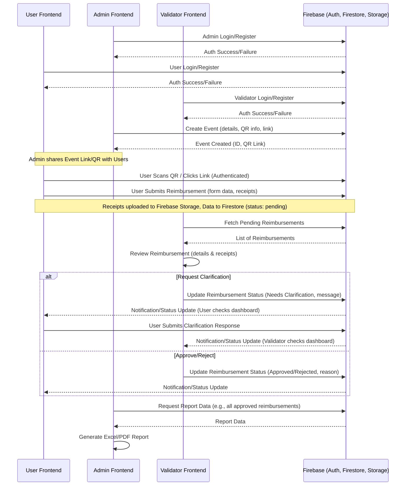
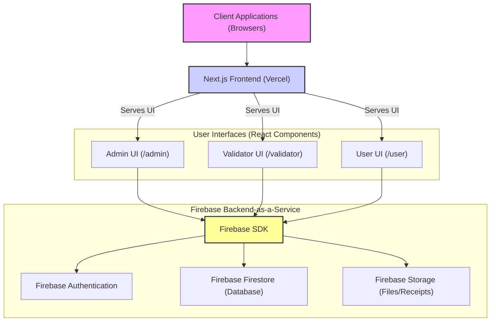

# ReimburseEase - Reimbursement Management System

## Overview

ReimburseEase is a web application designed to streamline and manage the expense reimbursement process within an organization. It provides distinct interfaces and functionalities for different user roles: Administrators, Validators, and regular Users. The system aims to simplify submission, validation, and reporting of reimbursement claims.

**Note:** This system is currently under development and not all features are fully implemented.

## Key Features

### 1. Admin Role

- **Dashboard:** Overview of system activity, key metrics (total users, active events, pending approvals, total reimbursed).
- **User Management:** Create, view, edit, and delete users (assigning roles like Admin, Validator, User).
- **Event Management:**
  - Create new reimbursement events (e.g., conferences, workshops).
  - Define event details: name, description, dates, location, allowed expense types, budget limits.
  - Generate shareable links and QR codes for users to submit reimbursements for specific events.
  - View and manage existing events (active, upcoming, completed).
- **Report Generation:**
  - Generate and export reports on reimbursements, events, and users.
  - Filter reports by date range, status, etc.
  - Export in formats like Excel and PDF.
- **(Future) System Configuration:** Manage overall system settings.

### 2. Validator Role

- **Dashboard:** Overview of pending reimbursements, items needing clarification, and recently approved claims.
- **Reimbursement Validation:**
  - Review submitted reimbursement requests.
  - Inspect attached documents/receipts.
  - Approve or reject individual expense items or entire claims.
  - Request clarification from users for specific items.
  - Add notes to receipts or claims.
- **(Future) AI-Assisted Document Analysis:** Potential for AI to help identify data from uploaded documents.

### 3. User Role

- **Dashboard:** Overview of personal reimbursement statuses (total submitted, pending, approved, needs clarification).
- **Reimbursement Submission:**
  - Submit new reimbursement requests, potentially by scanning a QR code or using a direct event link.
  - Select the relevant event.
  - Add multiple expense items (e.g., accommodation, transportation, meals).
  - Provide descriptions, amounts, and upload receipts for each item.
- **Track Status:** View the status of submitted reimbursements.
- **Respond to Clarifications:** Provide additional information or documents if requested by a validator.
- View past reimbursement history.

### General Features

- Role-Based Access Control (RBAC).
- User authentication (Login/Register).
- Responsive design for various screen sizes.
- Light/Dark theme toggle.
- Toast notifications for user actions.

## Tech Stack

- **Frontend Framework:** Next.js (App Router)
- **Language:** TypeScript
- **UI Components:** Shadcn/UI, Radix UI primitives
- **Styling:** Tailwind CSS
- **Icons:** Lucide React
- **Backend & Database:** Firebase (Authentication, Firestore, Storage)
- **State Management:** React Context (for Firebase)
- **Forms:** React Hook Form
- **Date Handling:** `date-fns`
- **Charting:** Recharts (for Admin Dashboard)
- **Linting/Formatting:** ESLint, Prettier
- **Deployment:** Vercel

## Project Structure

```

reimbursement-system/
├── app/ # Next.js App Router: Pages, Layouts, API Routes
│ ├── admin/ # Admin-specific routes and pages
│ ├── user/ # User-specific routes and pages
│ ├── validator/ # Validator-specific routes and pages
│ ├── login/ # Login page
│ ├── register/ # Registration page
│ ├── (root files) # Global layout, root page, etc.
│ └── ClientLayout.tsx # Client-side wrapper for providers
├── components/ # Reusable UI components
│ ├── admin/ # Admin-specific components
│ ├── demo/ # Components for demonstration purposes
│ ├── layout/ # Layout components (e.g., AppLayout)
│ ├── shared/ # Components shared across different parts
│ ├── ui/ # Shadcn/UI components
│ ├── user/ # User-specific components
│ └── validator/ # Validator-specific components
├── hooks/ # Custom React hooks (e.g., useMobile, useToast)
├── lib/ # Utility functions, libraries, Firebase integration
│ └── firebase/ # Firebase configuration, services, hooks, context
├── public/ # Static assets (images, fonts, etc.)
├── styles/ # Global CSS files (though most is Tailwind)
├── .husky/ # Git hooks (pre-commit)
├── ... # Configuration files (package.json, tsconfig.json, etc.)

```

## Setup and Running Locally

1.  **Prerequisites:**

    - Node.js (v18 or later recommended)
    - npm or yarn

2.  **Firebase Setup:**

    - Create a Firebase project at [https://console.firebase.google.com/](https://console.firebase.google.com/).
    - Enable Firebase Authentication (Email/Password provider).
    - Enable Firebase Firestore (Native mode).
    - Enable Firebase Storage.
    - Get your Firebase project configuration (API Key, Auth Domain, etc.).
    - Update the Firebase configuration in `lib/firebase/config/firebase-config.ts` and potentially other related files (`lib/firebase/firebase-config.ts`, `lib/firebase/context/firebase-provider.tsx`) with your project's credentials.
      ```typescript
      // Example in lib/firebase/config/firebase-config.ts
      export const firebaseConfig = {
        apiKey: "YOUR_API_KEY",
        authDomain: "YOUR_AUTH_DOMAIN",
        projectId: "YOUR_PROJECT_ID",
        storageBucket: "YOUR_STORAGE_BUCKET",
        messagingSenderId: "YOUR_MESSAGING_SENDER_ID",
        appId: "YOUR_APP_ID",
      };
      ```

3.  **Clone the Repository:**

    ```bash
    git clone <your-repository-url>
    cd reimbursement-system
    ```

4.  **Install Dependencies:**

    ```bash
    npm install
    # or
    yarn install
    ```

5.  **Run the Development Server:**

    ```bash
    npm run dev
    # or
    yarn dev
    ```

    The application will be available at `http://localhost:3000`.

6.  **Create Test Users:**
    - Navigate to the homepage (`http://localhost:3000`).
    - Use the "Create Test Users" button to populate Firebase Authentication with demo accounts for Admin, Validator, and User roles. This is essential for logging in and testing different functionalities.

## Application Flow (High-Level)

The following diagram illustrates the general flow of key operations within the system:



## System Architecture Diagram

A simplified view of the system's architecture:



## Future Enhancements / To-Do

As the system is still in development, planned features and improvements include:

- **AI-Powered Receipt Scanning:** Integrate OCR or AI to automatically extract data from uploaded receipts.
- **Advanced Analytics & Visualizations:** More detailed charts and data insights on the admin/validator dashboards.
- **Real-time Notifications:** Implement push notifications or real-time updates for status changes (e.g., using Firebase Realtime Database or Firestore listeners more extensively).
- **Payment Integration/Tracking:** Features to mark reimbursements as paid and track payment status.
- **Comprehensive Audit Logs:** Track all significant actions within the system.
- **Internationalization (i18n):** Support for multiple languages.
- **Enhanced Security:** Implement more granular permissions and security best practices.
- **Full Implementation of All User Stories:** Complete all outlined features for each role.
- **Improved Error Handling:** More robust error handling and user feedback mechanisms.
- **Unit and Integration Testing:** Add comprehensive tests.

## Contributing

Currently, this project is primarily managed via v0.dev. For major contributions or suggestions, please open an issue in this repository.

## License

This project is likely under a standard open-source license like MIT, but please verify if a `LICENSE` file is present. If not, assume it's proprietary until specified.

```

```
